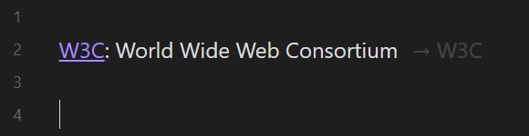
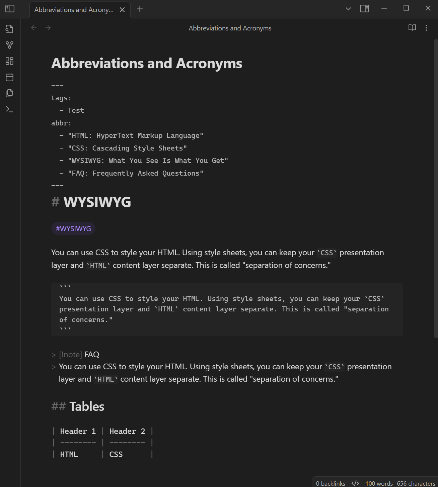
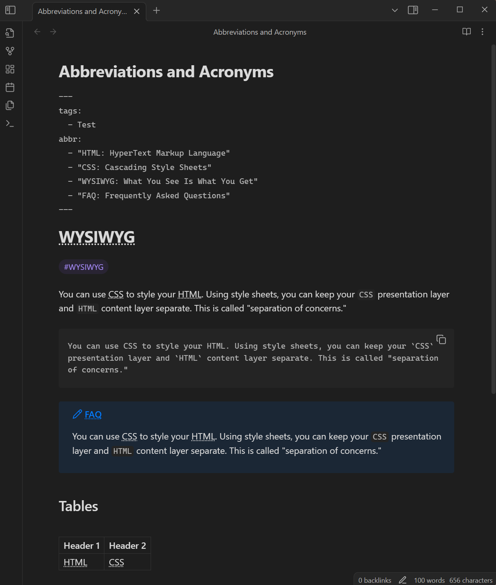
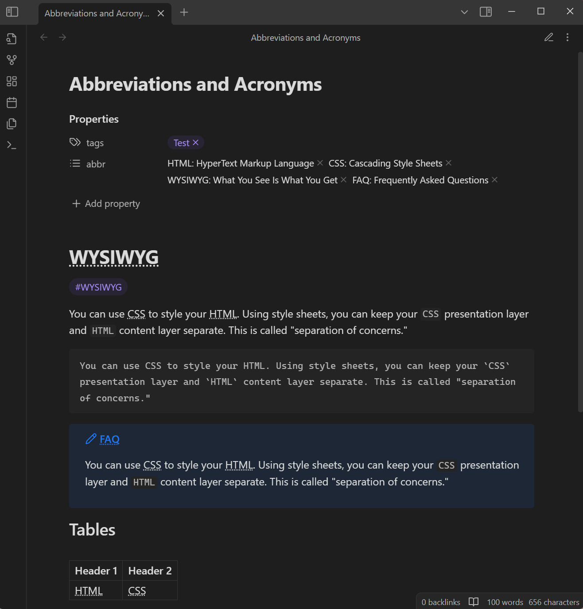

# Abbreviations and Acronyms

[English](./README.md) | [简体中文](./README-zh_CN.md) | **繁體中文**

## 介紹

這是一個用於 [Obsidian](https://obsidian.md) 的外掛，實現自動標記縮略語和術語。

此外掛支援在閱讀、實際預覽和原始碼模式（可選）渲染，同時支援列出當前檔案中的所有縮略語，以及縮略語元素的上下文選單。

## 用法

### 定義縮略語

您可以在[屬性](#屬性)或者使用 [Markdown Extra](#markdown-extra) 語法定義縮略語。

#### 屬性

外掛透過讀取筆記[屬性（元資料）](https://help.obsidian.md/Editing+and+formatting/Properties)中的指定欄位獲取縮略語。您可以使用[字串](#字串)列表或[鍵值對](#鍵值對)列表來定義縮略語。

##### 字串

在字串中使用冒號(`:`)分隔縮寫和全稱。示例：

```yaml
---
abbr:
  - "HTML: HyperText Markup Language"
  - "CSS: Cascading Style Sheets"
---
```

> [!TIP]
> 這種格式的優點是可以在可見模式中直接新增或刪除縮略語。

##### 鍵值對

使用縮寫作為鍵，全稱作為值。示例：

```yaml
---
abbr:
  - HTML: HyperText Markup Language
  - CSS: Cascading Style Sheets
---
```

#### Markdown Extra

> [!NOTE]
> 目前還沒有統一的語法規範，該外掛的實現類似於 [PHP Markdown Extra](https://michelf.ca/projects/php-markdown/extra/#abbr)。

您需要在外掛設定中[啟用 Markdown Extra 語法支援](#markdown-extra-語法)才能啟用此功能。外掛透過讀取筆記中指定格式的內容來獲取縮略語。

要定義一個縮略語，只需在筆記中某一行的開頭宣告，例如：

```text
*[W3C]: World Wide Web Consortium
```

也可以透過將值置為空來停用指定縮略語：

```text
*[W3C]: 
```

建議使用空行將定義區域與主要內容分隔開。例如：

```text
You can use CSS to style your HTML. 

*[HTML]: HyperText Markup Language
*[CSS]: Cascading Style Sheets

Using style sheets, you can keep your CSS presentation layer and HTML content layer separate.
```

### 相同的縮略語

當存在多個相同的縮略語時，其適用範圍如下：

```text
---
abbr:
  - RAM: Random Access Memory
---

RAM.

*[RAM]: Reliability, Availability, Maintainability

RAM.

*[RAM]: Remote Access Management

RAM.

*[RAM]: 

RAM.

```

渲染為：

```html
<abbr title="Random Access Memory">RAM</abbr>.

<abbr title="Reliability, Availability, Maintainability">RAM</abbr>.

<abbr title="Remote Access Management">RAM</abbr>.

RAM.
```

## 命令

### 新增縮略語

快速將縮略語新增到[屬性（元資料）](https://help.obsidian.md/Editing+and+formatting/Properties)。

### 複製並格式化內容

複製筆記內容並將縮略語轉換為 `<abbr>` 標籤，以便在不支援類似語法的其他 Markdown 編輯器中顯示它們。

例如，對於以下筆記內容：

```text
---
tags:
  - test
abbr:
  - HTML: HyperText Markup Language
---
# Example

You can use CSS to style your HTML. 

*[CSS]: Cascading Style Sheets

Using style sheets, you can keep your `CSS` presentation layer and `HTML` content layer separate.
```

此命令將複製以下內容到剪貼簿：

```markdown
# Example

You can use <abbr title="Cascading Style Sheets">CSS</abbr> to style your <abbr title="HyperText Markup Language">HTML</abbr>. 

Using style sheets, you can keep your `CSS` presentation layer and `HTML` content layer separate.
```

### 插入 Extra 定義

*此命令僅在[啟用 Markdown Extra 語法支援](#markdown-extra-語法)設定後才允許使用。*

在活動編輯器中，將 Markdown Extra 語法定義插入到當前游標位置。

當未選擇任何文字時，插入以下內容：

```text
*[<游標位置>]: 
```

當選定文字時，插入以下內容：

```text
*[<選定文字>]: <游標位置>
```

### 縮略語列表

列出當前檔案中所有縮略語，然後選擇一個並跳轉到其定義位置（對於 Markdown Extra 語法定義的縮略語），或直接編輯它（對於元資料或全域性縮略語）。

### 管理全域性縮略語

快速地管理[全域性縮略語](#全域性縮略語)。

## 設定

### 元資料關鍵詞

此外掛允許您自定義從[屬性](https：//help.obsidian.md/Editing+and+formatting/Properties)中讀取縮略語的關鍵詞，預設值為 `abbr`。

### 在原始碼模式中標記縮略語

在原始碼模式下標記縮略語，與在實際預覽和閱讀中一樣。

### 啟用非空格分隔語言的縮略語檢測

檢測不使用空格進行分詞的語言中的縮略語，例如中文。

舉例來說，對於以下筆記內容：

```text
---
abbr:
  - "立委: 立法委員"
---

各選區選出三名立委。
```

僅當啟用此選項時，它才會渲染為：

```html
各選區選出三名<abbr title="立法委員">立委</abbr>。
```

否則，保持原樣：

```html
各選區選出三名立委。
```

### 全域性縮略語

此外掛允許您自定義全域性可用的縮略語。它們的優先順序低於在筆記中定義的縮略語。

### Markdown Extra 語法

控制是否啟用 Markdown Extra 語法功能。

此外，您還可以向編輯檢視中顯示一個裝飾器，用於標識 Markdown Extra 語法的定義。裝飾器的內容可以使用兩個變數：`${abbr}` 和 `${tooltip}`，用於將當前定義的某些資訊引入內容。例如，對於 `→ ${abbr}`：



CSS 變數 `--abbreviations-definition-decorator-margin` 可用於定義裝飾器的間距，例如：

```css
body {
  --abbreviations-definition-decorator-margin: 12px;
}
```

### 字尾

此外掛允許匹配帶有字尾的縮略語。例如，它可以使得 `OS` 能夠匹配到 `OSes`。更多資訊請參見：[#3](https://github.com/dragonish/obsidian-abbreviations/issues/3)。

字尾列表由使用者定義，值以逗號(`,`)分隔的字串形式設定，例如：`s, es, less`。

## 預覽

**實際預覽：**

| 原始碼模式 | 實際預覽 |
| :---------: | :----------: |
|  |  |

**閱讀：**

| 原始碼模式 | 閱讀 |
| :---------: | :-----: |
|  |  |

## 許可

[MIT](/LICENSE)
