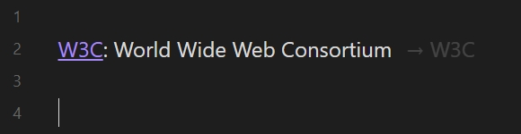
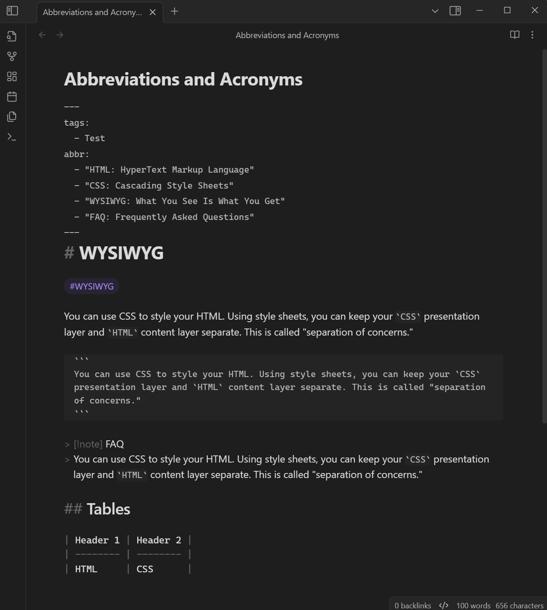

# Abbreviations and Acronyms

**English** | [简体中文](./README-zh_CN.md)

## Introduction

This is a plugin for [Obsidian](https://obsidian.md). Implements automatic marking of abbreviations and acronyms (terminology).

This plugin supports rendering in both reading view, editing view (*Live Preview*) and source mode (optional). Simultaneously support listing all abbreviations in the current file, and the context menu of the abbreviation element.

## Usage

### Define abbreviations

You can define abbreviations in [properties](#properties) or using [Markdown Extra](#markdown-extra) syntax.

#### Properties

The plugin gets abbreviations by reading the specified field in the note [properties(metadata)](https://help.obsidian.md/Editing+and+formatting/Properties). You can define abbreviations using a list of [strings](#strings) or a list of [key-value pairs](#key-value-pairs).

##### Strings

Use a colon (`:`) in the string to separate the abbreviation and the tooltip. Example:

```yaml
---
abbr:
  - "HTML: HyperText Markup Language"
  - "CSS: Cascading Style Sheets"
---
```

> [!TIP]
> The advantage of this format is that abbreviations can be added or removed directly in display mode.

##### Key-value pairs

Use the abbreviation for key and the tooltip for value. Example:

```yaml
---
abbr:
  - HTML: HyperText Markup Language
  - CSS: Cascading Style Sheets
---
```

#### Markdown Extra

> [!NOTE]
> Currently, there is no unified syntax specification, and the implementation of this plugin is similar to [PHP Markdown Extra](https://michelf.ca/projects/php-markdown/extra/#abbr).

You need to [Enable Markdown Extra syntax support](#markdown-extra-syntax) in the plugin settings to activate this feature. The plugin gets abbreviations by reading the specified format in the note.

To define an abbreviation, simply declare it at the beginning of a line in your notes, for example:

```text
*[W3C]: World Wide Web Consortium
```

Disable a specific abbreviation:

```text
*[W3C]: 
```

It is recommended to use blank lines to separate the definition area from the main content. For example:

```text
You can use CSS to style your HTML. 

*[HTML]: HyperText Markup Language
*[CSS]: Cascading Style Sheets

Using style sheets, you can keep your CSS presentation layer and HTML content layer separate.
```

### Same abbreviations

When there are multiple same abbreviations, the scope is as follows:

```text
---
abbr:
  - RAM: Random Access Memory
---

RAM.

*[RAM]: Reliability, Availability, Maintainability

RAM.

*[RAM]: Remote Access Management

RAM.

*[RAM]: 

RAM.

```

Rendered as:

```html
<abbr title="Random Access Memory">RAM</abbr>.

<abbr title="Reliability, Availability, Maintainability">RAM</abbr>.

<abbr title="Remote Access Management">RAM</abbr>.

RAM.
```

## Command

### Add abbreviation

Quickly add abbreviations to [properties(metadata)](https://help.obsidian.md/Editing+and+formatting/Properties).

### Copy and format content

Copy the note content and convert abbreviations to `<abbr>` tags, so that they can be displayed in other Markdown editors that do not support similar syntax.

For example, for the following note content:

```text
---
tags:
  - test
abbr:
  - HTML: HyperText Markup Language
---
# Example

You can use CSS to style your HTML. 

*[CSS]: Cascading Style Sheets

Using style sheets, you can keep your `CSS` presentation layer and `HTML` content layer separate.
```

This command will copy the following content to the clipboard:

```markdown
# Example

You can use <abbr title="Cascading Style Sheets">CSS</abbr> to style your <abbr title="HyperText Markup Language">HTML</abbr>. 

Using style sheets, you can keep your `CSS` presentation layer and `HTML` content layer separate.
```

### Insert extra definition

*This command is only allowed after enabling the [Enable Markdown Extra syntax support](#markdown-extra-syntax) setting.*

Insert definition of Markdown Extra syntax at current cursor position in activity editor.

When no text is selected, insert the following content:

```text
*[<cursor_position>]: 
```

When selected text exists, insert the following content:

```text
*[<selected_text>]: <cursor_position>
```

### List abbreviations

List all abbreviations in the current file, then select one and jump to its definition position (for *extra*), or edit it directly (for *metadata* or *global*).

### Manage global abbreviations

Quickly manage [global abbreviations](#global-abbreviations).

## Settings

### Metadata keyword

This plugin allows you to customize the keyword that read abbreviations from [properties](https://help.obsidian.md/Editing+and+formatting/Properties), default value is `abbr`.

### Mark abbreviations in Source mode

In Source mode, mark abbreviations just like in Live Preview and Reading view.

### Enable abbreviation detection for languages not separated by spaces

Detect abbreviations in languages that do not use spaces for word segmentation, such as CJK (Chinese, Japanese, Korean).

For example, for the following note content:

```text
---
abbr:
  - "北大: 北京大学"
---

我是一名北大学子。
```

Only when this option is enabled will it render as:

```html
我是一名<abbr title="北京大学">北大</abbr>学子。
```

Otherwise, keep it as is:

```html
我是一名北大学子。
```

### Global abbreviations

This plugin allows you to customize globally available abbreviations. Their priority is lower than abbreviations defined in the notes.

### Markdown Extra syntax

Enable or disable Markdown Extra syntax features.

In addition, you can show a decorator for extra syntax definitions in the editing view. The content of the decorator can use two variables: `${abbr}` and `${tooltip}`. To introduce certain information of the current definition into the content. For example, for `→ ${abbr}`:



The CSS variable `--abbreviations-definition-decorator-margin` can be used to define the spacing of decorators, for example:

```css
body {
  --abbreviations-definition-decorator-margin: 12px;
}
```

### Suffixes

This plugin allows match supplementary suffixes for abbreviations. For example, it can make the `OS` match other `OSes`. More information can see: [#3](https://github.com/dragonish/obsidian-abbreviations/issues/3).

Suffix list is defined by the user, with values set as comma-separated string. For example: `s, es, less`.

## Preview

**Live Preview:**

| Source mode | Live Preview |
| :---------: | :----------: |
|  |  |

**Reading:**

| Source mode | Reading |
| :---------: | :-----: |
|  |  |

## License

[MIT](/LICENSE) license
