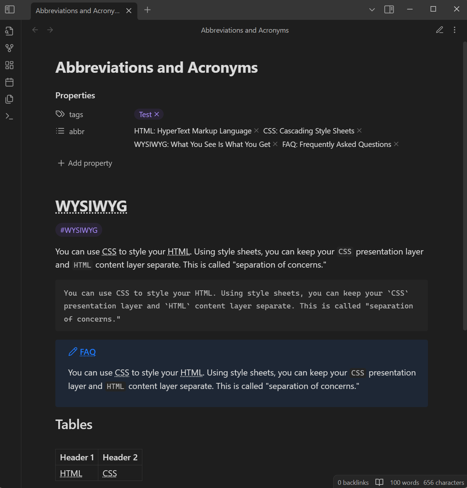

# Abbreviations and Acronyms

> Obsidian Plugin

## Introduction

This is a plugin for [Obsidian](https://obsidian.md).

Implements automatic marking of abbreviations and acronyms (terminology).

This plugin supports rendering in both editing view (*Live Preview*), reading view and source mode (optional).

## Usage

### Properties

Gets the abbreviations by reading the specified field in the note [properties(metadata)](https://help.obsidian.md/Editing+and+formatting/Properties), and automatically render the abbreviations in the note content.

#### Metadata format

You can use arrays of strings or key-value pairs.

##### Strings

Use a colon (`:`) in the string to separate the abbreviation and the tooltip.

Example:

```yaml
---
abbr:
  - "HTML: HyperText Markup Language"
  - "CSS: Cascading Style Sheets"
---
```

> [!TIP]
> The advantage of this format is that abbreviations can be added or removed directly in Reading view.

##### Key-value pairs

Use the abbreviation for key and the tooltip for value.

Example:

```yaml
---
abbr:
  - HTML: HyperText Markup Language
  - CSS: Cascading Style Sheets
---
```

### Markdown Extra syntax

> [!NOTE]
> This feature is experimental. Currently, there is no unified syntax specification, and the implementation of this plugin is similar to [PHP Markdown Extra](https://michelf.ca/projects/php-markdown/extra/#abbr).

You need to enable "Enable Markdown Extra syntax support (Experimental)" in the plugin settings to activate this feature.

Gets the abbreviations by reading the specified format in the note, and automatically render the abbreviations in the note content.

#### Definition format

Declare at the beginning of a line, for example:

```
*[W3C]: World Wide Web Consortium
```

Disable a specific abbreviation:

```
*[W3C]: 
```

#### Same abbreviations

When there are multiple same abbreviations, the scope is as follows:

```
---
abbr:
  - RAM: Random Access Memory
---

RAM.

*[RAM]: Reliability, Availability, Maintainability

RAM.

*[RAM]: Remote Access Management

RAM.

*[RAM]: 

RAM.

```

Rendered as:

```html
<abbr title="Random Access Memory">RAM</abbr>.

<abbr title="Reliability, Availability, Maintainability">RAM</abbr>.

<abbr title="Remote Access Management">RAM</abbr>.

RAM.
```

## Settings

### Metadata keyword

This plugin allows you to customize the keyword that read abbreviations from [properties](https://help.obsidian.md/Editing+and+formatting/Properties), default value is `abbr`.

### Mark abbreviations in Source mode

In Source mode, mark abbreviations just like in Live Preview and Reading view.

### Global abbreviations

This plugin allows you to customize globally available abbreviations.

If you want to disable a specific abbreviation in your notes, you can declaring the abbreviation as an empty string value in the [properties](https://help.obsidian.md/Editing+and+formatting/Properties).

Example:

```yaml
---
abbr:
  - "HTML:  " # string format
  - CSS: "" # key-value pair format
---
```

### Affixes

This plugin allows match supplementary affixes for abbreviations. For example, it can make the `OS` match other `OSes`. More information can see: [#3](https://github.com/dragonish/obsidian-abbreviations/issues/3).

Affix list is defined by the user, with values set as comma-separated string. For example: `s, es, less`.

## Preview

**Live Preview:**

| Source mode | Live Preview |
| :---------: | :----------: |
|  |  |

**Reading:**

| Source mode | Reading |
| :---------: | :-----: |
|  |  |

## License

[MIT](/LICENSE) license
